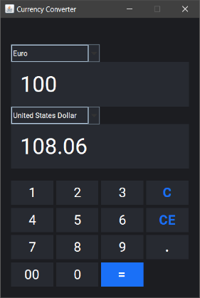

# Currency Converter

App for converting currency using external API with real-time exchange rate fetching. 

## Usage
Run command:
```
mvn exec:java
```

## Demo



## Notes
- Requires Maven installed.
- Currently only supports 18 currencies.
- API used: https://exchangerate.host.
